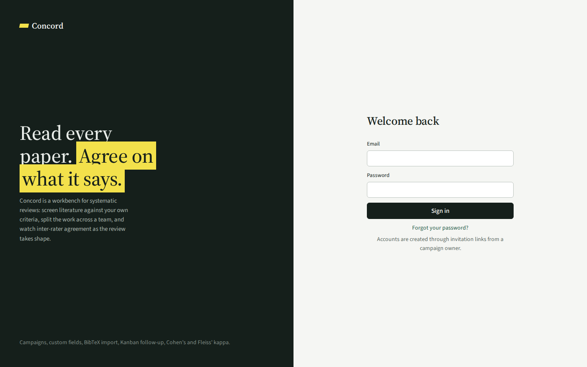
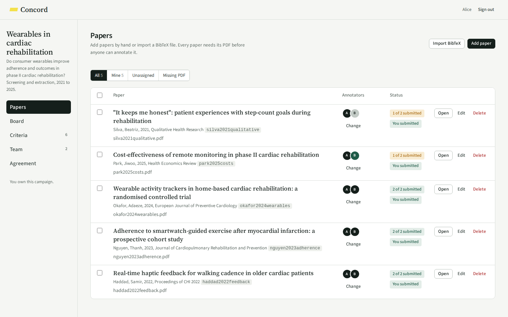
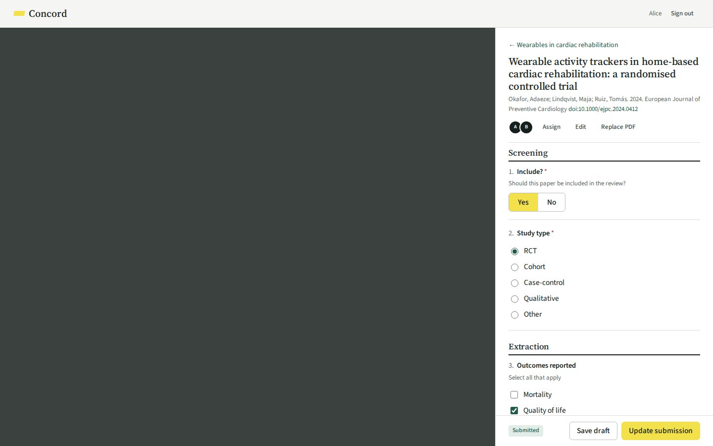
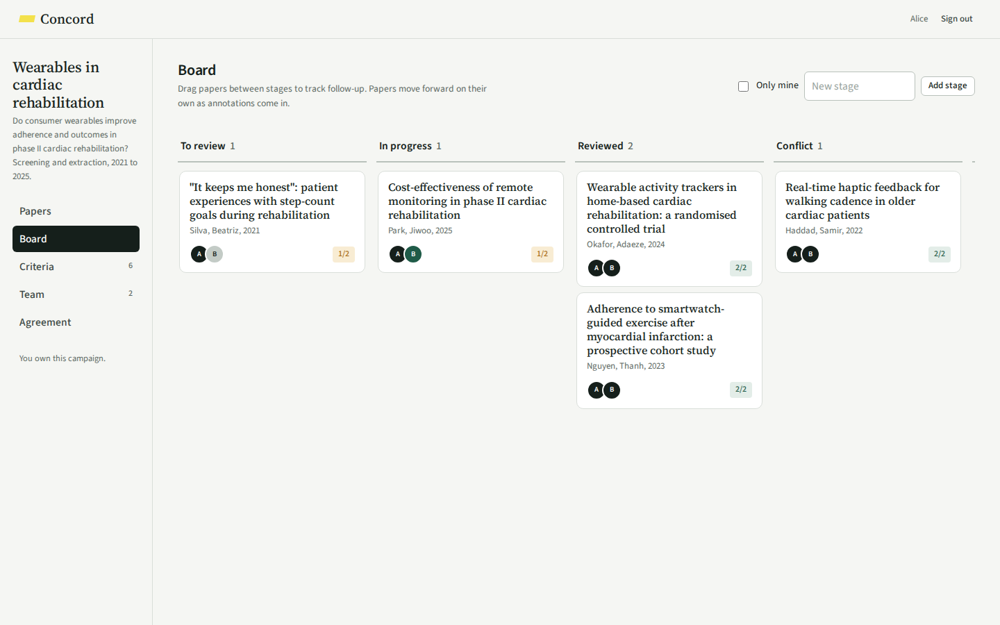
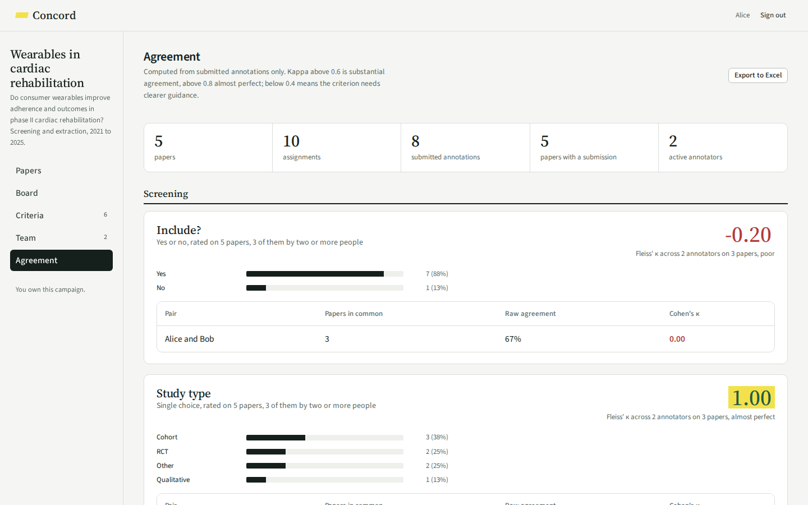

<p align="center">
  
</p>

# Concord

**Read every paper. Agree on what it says.**

Concord is a lightweight, self-hosted workbench for systematic literature reviews. Define your screening and extraction criteria, import the papers with their PDFs, share the work across a team, and watch inter-rater agreement as the review takes shape.

It is built for small research groups who want their own instance up in ten minutes: one container, one SQLite file, no external services beyond an SMTP mailbox.

## What you get

| | |
|---|---|
| **Campaigns** | One per review. Each has its own criteria, papers, team and Kanban board. The person who creates it owns it, and ownership can be handed over. |
| **Your criteria, your codebook** | Six answer types: single choice, multiple choice, yes/no, scale, number, free text. Add them one by one or import a spreadsheet. Options carry coding rules that annotators see while they work, and criteria are grouped into sections. |
| **Papers with their PDFs** | Import a BibTeX file, drag it onto the page, or add papers by hand. Every paper needs its PDF before anyone can annotate it, so nobody codes from memory. Drop PDFs named after their citation keys and they attach themselves. |
| **A team** | Invite by email. New people choose a password from a one-time link; existing accounts are added at once. Assign one or several annotators per paper, singly or in bulk. |
| **Side-by-side reading** | The PDF on the left, the criteria on the right, drafts saved as you go. Submit when done; required criteria are checked. |
| **Follow-up on a board** | Drag papers between stages. Papers advance on their own as annotations come in, and land in a conflict column for you to resolve. |
| **Agreement you can act on** | Cohen's and Fleiss' kappa per criterion, raw agreement, per-option kappa for multiple choice, a list of every disagreement, and an Excel export of everything. |

## A look around

<table>
  <tr>
    <td></td>
    <td></td>
  </tr>
  <tr>
    <td></td>
    <td></td>
  </tr>
</table>

## Quick start

```bash
git clone https://github.com/Badmavasan/concord.git && cd concord
npm run install:all
npm run dev              # API on http://localhost:4321, UI on http://localhost:5173
```

Create an account on the sign-in page, start a campaign, and follow the prompts. For a server, see the [deployment guide](docs/deployment.md): it is `docker compose up -d` plus a reverse proxy, with everything configured from a single `.env` file.

## Documentation

- [Getting started](docs/getting-started.md): the workflow from first account to exported results
- [Features](docs/features.md): every feature, in detail
- [Deployment](docs/deployment.md): Docker, nginx or Caddy, systemd, updates and backups
- [Command line](docs/cli.md): bulk data injection and administration
- [Criteria spreadsheets](docs/criteria.md): the two accepted layouts and how codebooks are mapped
- [Email](docs/email.md): SMTP configuration, deliverability, what is sent and when
- [Agreement statistics](docs/statistics.md): what is computed for each criterion type
- [Security](docs/security.md): the threat model and the measures in place
- [Architecture](docs/architecture.md): how the code is organised
- [API](docs/api.md): every endpoint
- [Development](docs/development.md): running the tests, contributing

## Built with

Node.js 22 and Express, with SQLite through the runtime's built-in module (no native builds). React 18 and Vite on the front. The whole server is a few thousand lines you can read in an afternoon.

## Contributing and security

Contributions are welcome: see [CONTRIBUTING.md](CONTRIBUTING.md). To report a vulnerability, see [SECURITY.md](SECURITY.md).

## License

[MIT](LICENSE). Free to use, modify and redistribute for any purpose.
